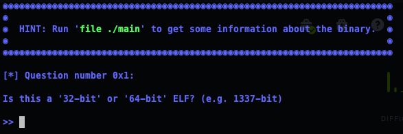

---
last_update:
    date: 2024-03-26
tags: ['ELF', 'Pwn', 'HackTheBox']
---

# [HackTheBox - Lesson](https://app.hackthebox.com/challenges/Lesson)

## 0. Analysis

The challange package states that connecting to the server using nc. Followed by, it is a interactive series of questions.

<center>



</center>

## 1. Questions

### 0x1: Is this a '32-bit' or '64-bit' ELF? (e.g. 1337-bit)

```sh
readelf -h main

ELF Header:
  Magic:   7f 45 4c 46 02 01 01 00 00 00 00 00 00 00 00 00
  Class:                             ELF64
  Data:                              2's complement, little endian
  Version:                           1 (current)
  OS/ABI:                            UNIX - System V
  ABI Version:                       0
  Type:                              EXEC (Executable file)
  Machine:                           Advanced Micro Devices X86-64
  Version:                           0x1
  Entry point address:               0x4010f0
  Start of program headers:          64 (bytes into file)
  Start of section headers:          14168 (bytes into file)
  Flags:                             0x0
  Size of this header:               64 (bytes)
  Size of program headers:           56 (bytes)
  Number of program headers:         13
  Size of section headers:           64 (bytes)
  Number of section headers:         30
  Section header string table index: 29
```

### 0x2: Which of these 3 protections are enabled (Canary, NX, PIE)?

```sh
checksec --format=json --file=./main
```

```json
{
   "./main":{
      "relro":"full",
      "canary":"no",
      "nx":"yes",
      "pie":"no",
      "rpath":"no",
      "runpath":"yes",
      "symbols":"yes",
      "fortify_source":"no",
      "fortified":"0",
      "fortify-able":"2"
   }
}
```

### 0x3: What do you need to enter so the message 'Welcome admin!' is printed?

By given the C code: `printf(strncmp(formatter, "admin", 5) == 0 ? "\nWelcome admin!\n\n" : "\nWelcome user!\n\n");  `

```c
#include <stdio.h>

void under_construction(){
  printf("This is under development\n");
}

void print_msg(char *user){
  char formatter[0x20];
  strncpy(formatter, user, 5);
  for (size_t i = 0; i < 5; i++) formatter[i] = tolower(formatter[i]);
  printf(strncmp(formatter, "admin", 5) == 0 ? "\nWelcome admin!\n\n" : "\nWelcome user!\n\n");  
}

int main(int argc, char **argv){
  char name[0x20] = {0};
  unsigned long x, y;
  printf("Enter your name: ");
  scanf("%s", name);
  print_msg(name);
  return 0;
}
```

### 0x4: What is the size of the 'name' buffer (in hex or decimal)?

by the given code: `char name[0x20] = {0};`

### 0x5: Which custom function is never called? (e.g. vuln())

by the given code: `under_construction()`

### 0x6: What is the name of the standard function that could trigger a Buffer Overflow? (e.g. fprintf())

by the given code: `scanf("%s", name);` since the input is able to manipulated by interaction.


### 0x7: Insert 30, then 39, then 40 'A's in the program and see the output. After how many bytes a Segmentation Fault occurs (in hex or decimal)?

after 40 bytes, a segmentation fault occurs.

### 0x8: What is the address of 'under_construction()' in hex? (e.g. 0x401337)

```sh
gdb ./main

$ p nder_construction
```